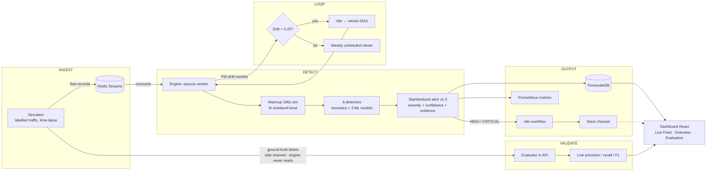

# Diode Watch — Slide: Technologies & Methodology

One-slide content for **"Technologies used"** + **"Methodology & process"**.
Renders in any Mermaid-capable viewer (mermaid.live, GitHub, Obsidian, Notion).
Keep the bullets as-is for the slide; the diagram goes beside/below them.

---

## 1) Technologies

**Languages & ML**
- **Python 3.12** — engine, simulator, dashboard API
- **scikit-learn** (IsolationForest ×2, LogisticRegression, StandardScaler)
- **LightGBM** (offline DGA analysis) · **SciPy/NumPy** (FFT, linear algebra)

**Data & streaming**
- **Redis Streams** — flow ingest + ground-truth side channel + pub/sub
- **TimescaleDB** (PostgreSQL + hypertable) — time-partitioned alert store

**Backend & frontend**
- **FastAPI + WebSockets** — REST API, live relay, ground-truth evaluator
- **React + Vite + Recharts** — real-time dashboard
- **n8n** — alert routing → Slack + scheduled/triggered retrains
- **Prometheus + Grafana** — engine metrics (optional profile)

**Deployment / hardware context**
- **Docker + Docker Compose** — reproducible single-command stack
- **Slack Incoming Webhooks** — operator notifications
- **One-way data diode / passive tap** — the monitoring enclave sees traffic,
  can never send back (the constraint that shapes every choice)

---

## 2) Methodology & process

---

## 3) Process in words (one line each)

1. **Acquire** — labelled simulator emits benign + 8 attack families on a
   time-lapse clock (4× real time).
2. **Ingest** — flow records streamed into Redis; ground-truth labels go to a
   separate stream the engine never reads.
3. **Learn** — 180 s benign warmup → unsupervized IsolationForest fit (no
   labels, honours the one-way constraint).
4. **Detect** — six streaming detectors: DDoS, C2 beacon, DGA/DNS-tunnel,
   TLS-malware (no decryption), recon, exfil.
5. **Alert** — one versioned JSON schema; severity+confidence; session
   dedup/cooldown; HIGH/CRITICAL forwarded.
6. **Persist & show** — TimescaleDB hypertable + live React dashboard.
7. **Validate** — live precision/recall/F1 vs the ground-truth side channel
   (campaign-level episodes).
8. **Respond & adapt** — n8n routes alerts to Slack; PSI drift auto-triggers
   DGA retrain; weekly scheduled retrain closes the loop — all inside the
   enclave, no external services.

---

## 4) Working prototype — "built, running, measured"

- Single command: `docker compose up -d --build` (+ `make n8n-import`)
- Live results: **~2,160–2,210 flows/sec** sustained vs **2,000 target**
- All 6 families alerting end-to-end → TimescaleDB → dashboard → Slack
- 34 unit tests passing; live evaluation tab shows TP/FP/FN per class

---

*Diagram key: `INGEST → DETECT → OUTPUT`, with `VALIDATE` (honest scoring) and
`LOOP` (drift/retrain) shown as separate swim-lane groups.*